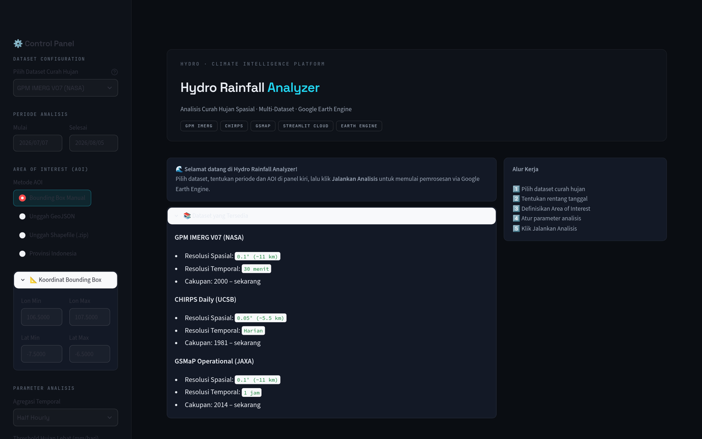

# 🌧️ Hydro Rainfall Analyzer

> **Analisis curah hujan spasial multi-dataset berbasis Google Earth Engine (GEE).**
> Pilih dataset satelit, tentukan wilayah & periode, lalu dapatkan statistik, grafik interaktif, dan peta distribusi hujan — semuanya dari browser.

[](https://hydrorainfallapp.streamlit.app)
[](https://python.org)
[](LICENSE)
[](https://earthengine.google.com)
[](https://streamlit.io)

---

## 📑 Daftar Isi

- [Tentang Proyek](#-tentang-proyek)
- [Fitur Utama](#-fitur-utama)
- [Tampilan Aplikasi](#-tampilan-aplikasi)
- [Cara Menggunakan](#-cara-menggunakan)
- [Memahami Hasil Analisis](#-memahami-hasil-analisis)
- [Dataset yang Didukung](#-dataset-yang-didukung)
- [Instalasi Lokal](#-instalasi--menjalankan-secara-lokal)
- [Autentikasi Google Earth Engine](#-autentikasi-google-earth-engine)
- [Deploy ke Streamlit Cloud](#-deploy-ke-streamlit-cloud)
- [Arsitektur Aplikasi](#-arsitektur-aplikasi)
- [Metodologi](#-metodologi)
- [Stack Teknologi](#-stack-teknologi)
- [Lisensi](#-lisensi)

---

## 📌 Tentang Proyek

**Hydro Rainfall Analyzer** adalah aplikasi web open-source untuk analisis curah hujan yang memanfaatkan komputasi cloud **Google Earth Engine** untuk memproses dataset hujan satelit (GPM IMERG, CHIRPS, GSMaP) pada skala regional hingga global.

Aplikasi ini dirancang untuk membantu:

| Pengguna | Kegunaan |
|---------|----------|
| 👨‍🔬 **Analis hidrologi** | Memantau distribusi hujan harian & kejadian ekstrem |
| 🌍 **Peneliti iklim** | Analisis statistik spasial multi-dekade |
| 🏗️ **Insinyur sumber daya air** | Input untuk perencanaan drainase, bendungan, dan irigasi |
| 🎓 **Mahasiswa & akademisi** | Eksplorasi data hujan satelit tanpa perlu infrastruktur sendiri |

Tanpa perlu mengunduh data atau memiliki mesin khusus — cukup browser dan koneksi internet.

---

## ✨ Fitur Utama

| Fitur | Keterangan |
|-------|-----------|
| 🛰️ **Multi-Dataset** | GPM IMERG (NASA), CHIRPS (UCSB), GSMaP (JAXA) |
| 📅 **Agregasi Fleksibel** | Harian, mingguan, bulanan |
| 🗺️ **Peta Spasial Interaktif** | Layer hasil GEE + basemap OSM/Google Satellite + legenda BMKG |
| 📊 **Statistik Spasial** | Mean, Min, Max, StdDev, Persentil (P50–P99) |
| 🌩️ **Analisis Threshold** | Deteksi hujan lebat & ekstrem, klasifikasi intensitas BMKG |
| 📐 **Input AOI Fleksibel** | Bounding box manual, upload GeoJSON/Shapefile, atau preset provinsi |
| 🇮🇩 **Indonesia-Ready** | Preset **34 provinsi** Indonesia |
| ⬇️ **Ekspor CSV** | Unduh hasil analisis langsung dari browser |
| 🎨 **UI Modern** | Tema dark flat "Hydro" — desain presisi, aksen cyan, nyaman untuk data |

---

## 🖥️ Tampilan Aplikasi



*Halaman utama: panel kontrol di kiri (dataset, periode, AOI, parameter), ringkasan dataset & alur kerja di tengah.*

---

## 🚀 Cara Menggunakan

### Akses langsung (tanpa instalasi)

Buka **[hydrorainfallapp.streamlit.app](https://hydrorainfallapp.streamlit.app)** — aplikasi berjalan sepenuhnya di cloud.

### Alur kerja 5 langkah

```
1️⃣ Pilih Dataset  →  GPM IMERG / CHIRPS / GSMaP
        │
2️⃣ Tentukan Periode  →  Tanggal mulai & selesai
        │
3️⃣ Definisikan AOI  →  Bounding box / GeoJSON / Shapefile / Provinsi
        │
4️⃣ Atur Parameter  →  Agregasi, threshold hujan lebat, persentil
        │
5️⃣ Klik "Jalankan Analisis"  →  hasil muncul dalam beberapa detik
```

### Detail tiap langkah

**1. Dataset** — pilih sumber data hujan satelit (lihat [tabel dataset](#-dataset-yang-didukung) untuk perbedaan resolusi & cakupan).

**2. Periode** — rentang tanggal analisis. Aplikasi otomatis menyesuaikan agregasi (harian/mingguan/bulanan) dengan dataset yang dipilih.

**3. AOI (Area of Interest)** — tentukan wilayah analisis dengan 4 cara:
- **Bounding Box Manual** — masukkan koordinat lon/lat langsung (paling cepat untuk wilayah persegi)
- **Unggah GeoJSON** — file `.geojson` / `.json` dengan fitur polygon
- **Unggah Shapefile (.zip)** — archive `.zip` berisi `.shp`, `.shx`, `.dbf`, `.prj` (otomatis direproyeksi ke EPSG:4326)
- **Provinsi Indonesia** — pilih dari 34 preset provinsi

**4. Parameter** — atur threshold hujan lebat (default 50 mm/hari) dan persentil statistik (default P95).

**5. Jalankan** — proses berjalan di Google Earth Engine dengan progress bar, lalu hasil tampil dalam 5 tab (lihat di bawah).

---

## 📊 Memahami Hasil Analisis

Setelah analisis selesai, muncul **5 kartu metrik** dan **5 tab hasil**:

### Kartu Metrik
| Metrik | Arti |
|--------|------|
| 🌧️ Total Curah Hujan | Akumulasi rata-rata spasial selama periode |
| 📊 Rata-rata Harian | Mean spasial per hari |
| ⬆️ Maksimum | Nilai tertinggi harian |
| 📈 P95 | Persentil ke-95 — indikator kejadian ekstrem |
| ⛈️ Hari Hujan Lebat | Jumlah hari dengan hujan ≥ threshold |

### Tab Hasil

| Tab | Isi |
|-----|-----|
| 📈 **Time Series** | Grafik area curah hujan harian + garis threshold + highlight kejadian ekstrem |
| 📊 **Statistik Spasial** | Bar chart bulanan (Mean/Max/Pxx) + akumulasi per bulan + pie klasifikasi intensitas |
| 🔥 **Heatmap Threshold** | Kalender intensitas hujan (bulan × hari) dengan palet BMKG |
| 🗺️ **Peta** | Peta distribusi spasial rata-rata hujan harian + legenda BMKG interaktif |
| 📋 **Data Tabel** | Tabel statistik harian lengkap, bisa diunduh sebagai **CSV** |

> 💡 **Tip**: Kombinasi tab *Time Series* + *Peta* paling berguna untuk mengidentifikasi **kapan** dan **di mana** hujan ekstrem terjadi.

---

## 🛰️ Dataset yang Didukung

| Dataset | Asset GEE | Resolusi Spasial | Resolusi Temporal | Cakupan |
|---------|-----------|------------------|-------------------|---------|
| **GPM IMERG V07** (NASA) | `NASA/GPM_L3/IMERG_V07` | 0.1° (~11 km) | 30 menit | 2000 – sekarang |
| **CHIRPS Daily** (UCSB) | `UCSB-CHG/CHIRPS/DAILY` | 0.05° (~5.5 km) | Harian | 1981 – sekarang |
| **GSMaP Operational** (JAXA) | `JAXA/GPM_L3/GSMaP/v6/operational` | 0.1° (~11 km) | 1 jam | 2014 – sekarang |

**Catatan konversi:**
- GPM IMERG: band `precipitation` (mm/jam) × 0.5 → mm per 30 menit
- CHIRPS: band `precipitation` (mm/hari) × 1.0 → langsung mm/hari
- GSMaP: band `hourlyPrecipRate` (mm/jam) × 1.0 → mm per jam

---

## 🛠️ Instalasi & Menjalankan Secara Lokal

### Prasyarat
- Python **3.10 atau 3.11**
- Akun Google Earth Engine ([daftar gratis](https://earthengine.google.com/signup/))
- Git

### Langkah-langkah

```bash
# 1. Clone repositori
git clone https://github.com/ilazohgla/hydro_rainfall_app.git
cd hydro_rainfall_app

# 2. Buat virtual environment
python -m venv venv

# Windows
venv\Scripts\activate
# macOS / Linux
source venv/bin/activate

# 3. Install dependensi
pip install -r requirements.txt

# 4. Autentikasi GEE (cukup sekali)
earthengine authenticate

# 5. Jalankan aplikasi
streamlit run app.py
```

Buka browser di **http://localhost:8501** 🎉

---

## 🔐 Autentikasi Google Earth Engine

Aplikasi menggunakan **strategi autentikasi berlapis** agar bekerja di berbagai lingkungan:

```
┌─────────────────────────────────────────────────────┐
│           Strategi Autentikasi (Prioritas)          │
├─────┬───────────────────────────────────────────────┤
│  1  │ Streamlit Secrets       → Production (Cloud)  │
│  2  │ Environment Variable    → Docker / CI/CD       │
│  3  │ Local credentials file  → Development          │
│  4  │ ~/.config/earthengine/  → Development          │
└─────┴───────────────────────────────────────────────┘
```

### Untuk development lokal

```bash
# Jalankan sekali, ikuti instruksi di browser
earthengine authenticate
```

### Untuk deployment cloud (Service Account)

1. **Buat Service Account** di [Google Cloud Console](https://console.cloud.google.com/iam-admin/serviceaccounts):
   - IAM & Admin → Service Accounts → Create Service Account
   - Role: **Earth Engine Resource Viewer** (minimal)

2. **Generate Private Key**:
   - Service Account → Keys → Add Key → JSON
   - Simpan file `.json` di tempat aman — **JANGAN pernah commit ke GitHub!**

3. **Daftarkan Service Account di GEE**:
   ```
   https://code.earthengine.google.com/register
   ```
   Pilih *"Use with a Cloud Project"* dan daftarkan email service account.

4. **Tambahkan ke Streamlit Secrets** (Dashboard → App Settings → Secrets):

   ```toml
   GEE_SERVICE_ACCOUNT = "nama-sa@project-id.iam.gserviceaccount.com"
   GEE_PRIVATE_KEY = """
   [REDACTED PRIVATE KEY]
   """
   ```

   > ⚠️ **Keamanan**: Private key bersifat rahasia. Streamlit Secrets dienkripsi dan tidak pernah terekspos ke publik atau ke dalam kode.

> 📄 Template lengkap tersedia di [`.streamlit/secrets.toml.template`](.streamlit/secrets.toml.template).

---

## 🚀 Deploy ke Streamlit Cloud

```bash
# 1. Push ke GitHub (pastikan secrets.toml TIDAK ter-commit — sudah di .gitignore)
git add .
git commit -m "Deploy Hydro Rainfall Analyzer"
git push origin main
```

2. Buka [share.streamlit.io](https://share.streamlit.io) → **Create app**
3. Hubungkan repositori GitHub → set **Main file: `app.py`**
4. **Advanced settings → Secrets** → paste konfigurasi GEE di atas
5. Klik **Deploy** — aplikasi live dalam hitungan menit ✅

---

## 🏗️ Arsitektur Aplikasi

```
hydro_rainfall_app/
│
├── app.py                      # Entry point Streamlit (UI + alur utama)
├── requirements.txt            # Dependensi Python
├── .gitignore
│
├── config/
│   ├── __init__.py
│   └── settings.py             # Konfigurasi dataset GEE, 34 provinsi, threshold
│
├── utils/
│   ├── __init__.py
│   ├── ee_auth.py              # Autentikasi Earth Engine (multi-strategy)
│   ├── ee_processing.py        # Logika inti GEE: agregasi + statistik spasial
│   └── chart_builder.py        # Builder grafik Plotly (tema Hydro)
│
├── docs/
│   └── screenshot.png          # Screenshot aplikasi untuk README
│
└── .streamlit/
    ├── config.toml             # Konfigurasi tema & server Streamlit
    └── secrets.toml.template   # Template autentikasi (JANGAN di-commit)
```

### Alur Data

```
[GEE ImageCollection]
       │
       ▼
aggregate_to_daily()          ← Konversi sub-harian → harian/mingguan/bulanan
       │                         (sum + scale_factor ke mm)
       ▼
build_stats_fc()              ← reduceRegion per periode
       │                         (Mean, Min, Max, StdDev, Pxx)
       ▼
compute_threshold_summary()   ← Klasifikasi intensitas BMKG
       │                         (Normal, Lebat, Ekstrem)
       ▼
[Plotly Charts + Folium Map]  ← Visualisasi interaktif di Streamlit
```

---

## 🔬 Metodologi

### Konversi ke nilai harian

```python
# GPM IMERG (30 menit, mm/jam) → mm/hari
daily_sum = collection
    .filterDate(day_start, day_end)
    .select("precipitation")
    .sum()
    .multiply(0.5)   # mm/jam × 0.5 jam = mm per step

# CHIRPS (sudah mm/hari) → langsung
daily_sum = collection
    .filterDate(day_start, day_end)
    .select("precipitation")
    .sum()
    .multiply(1.0)
```

### Statistik spasial (satu pass, semua metrik)

```python
reducer = (ee.Reducer.mean()
    .combine(ee.Reducer.min(), sharedInputs=True)
    .combine(ee.Reducer.max(), sharedInputs=True)
    .combine(ee.Reducer.stdDev(), sharedInputs=True)
    .combine(ee.Reducer.percentile([95]), sharedInputs=True))

stats = image.reduceRegion(
    reducer=reducer,
    geometry=aoi,
    scale=5000,
    maxPixels=1e13,
    bestEffort=True,
)
```

### Klasifikasi intensitas hujan (BMKG)

| Kelas / Kategori | Range (mm/hari) | Kode Warna |
|------------------|-----------------|------------|
| Sangat Ringan / Normal | < 10 | `#3D0909` |
| Ringan | 10 – 20 | `#8B251E` |
| Sedang | 20 – 50 | `#D95F02` |
| Lebat | 50 – 75 | `#E6AB02` |
| Sangat Lebat | 75 – 100 | `#FFF200` |
| Ekstrem (Level I) | 100 – 150 | `#D2F53C` |
| Ekstrem (Level II) | 150 – 200 | `#89DB89` |
| Ekstrem (Level III) | 200 – 250 | `#34A834` |
| Ekstrem (Bencana) | ≥ 250 | `#005A00` |

---

## 🧰 Stack Teknologi

| Komponen | Library | Versi |
|----------|---------|-------|
| Frontend / UI | Streamlit | ≥ 1.35 |
| GEE Interface | geemap | ≥ 0.31 |
| GEE Backend | earthengine-api | ≥ 0.1.390 |
| Peta Interaktif | Folium | ≥ 0.15 |
| Grafik | Plotly | ≥ 5.18 |
| Data | Pandas / NumPy | ≥ 2.1 / ≥ 1.26 |
| Geospasial | GeoPandas / Shapely | ≥ 0.14 / ≥ 2.0 |

---

## 📄 Lisensi

Distributed under the **MIT License**. Bebas digunakan untuk keperluan pendidikan, penelitian, dan komersial — lihat file [LICENSE](LICENSE) untuk detail lengkap.

---

<p align="center">
  Dibangun dengan ❤️ dan ☁️ Google Earth Engine<br>
  <sub>Streamlit · geemap · Plotly · Folium</sub>
</p>
